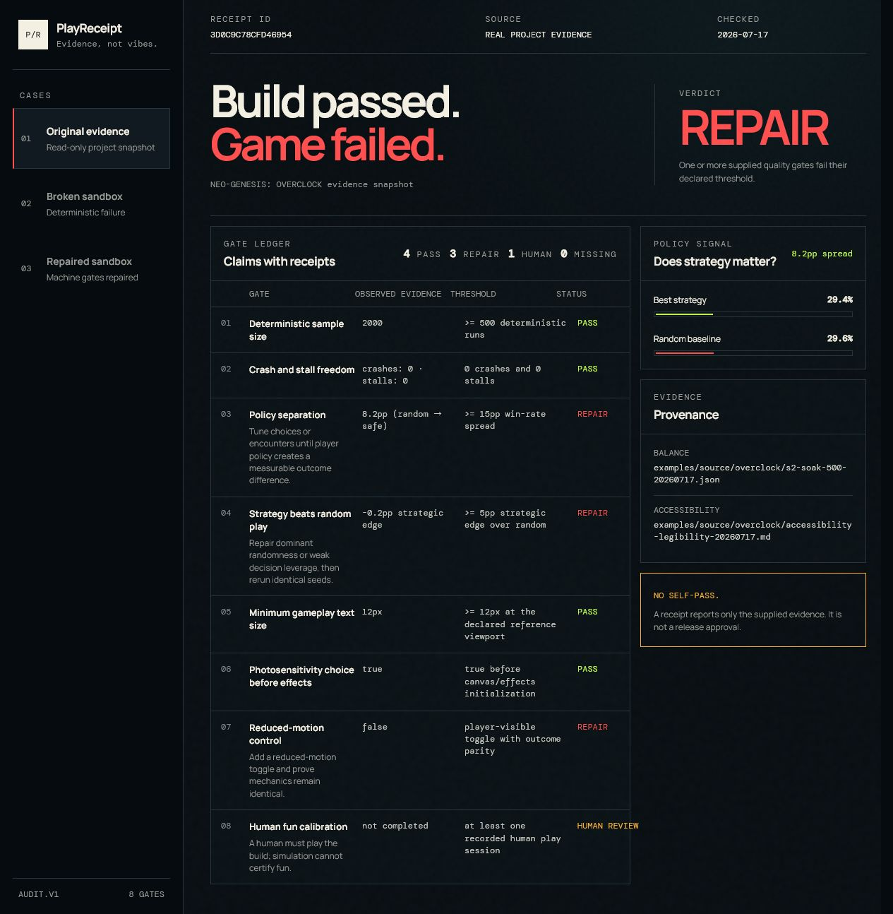

# PlayReceipt

> **Build passed. Game failed.**

PlayReceipt is an evidence gate for AI-built games. It converts reliability, balance, accessibility, and human-play evidence into stable receipts with four honest outcomes: `PASS`, `REPAIR`, `HUMAN_REVIEW`, or `UNVERIFIED`.



## Why it exists

AI coding tools can make a build green quickly. A green build does not prove that player choices matter, the interface is safe to read, or the game is fun. PlayReceipt makes those missing claims visible and refuses to manufacture certainty.

The included real-project case is the point: 2,000 seeded runs completed with zero crashes and stalls, yet weak policy separation, no reduced-motion proof, and no human fun calibration keep the verdict at `REPAIR`.

## Run it

Requires Node.js 20 or newer. There are no runtime npm dependencies.

```bash
npm test
npm run demo
```

Open `http://127.0.0.1:4175`.

CLI examples:

```bash
node src/cli.js audit examples/overclock-20260717.json
node src/cli.js simulate broken
node src/cli.js simulate repaired
```

CLI exit codes are designed for agents and CI:

| Exit | Verdict | Meaning |
|---:|---|---|
| 0 | `PASS` | All supplied gates pass |
| 2 | `REPAIR` | At least one threshold fails |
| 3 | `UNVERIFIED` | Required evidence is missing |
| 4 | `HUMAN_REVIEW` | Machine gates pass; human judgment remains |

## The eight gates

PlayReceipt checks deterministic sample size, crash/stall freedom, policy separation, strategic edge over random play, minimum gameplay font size, photosensitivity choice, reduced-motion support, and human fun calibration. Rules and thresholds are explicit in [BUILDSPEC.md](BUILDSPEC.md).

The receipt ID is the first 16 hex characters of a SHA-256 hash over canonical project, date, and gate data. Identical evidence produces an identical receipt.

## Three-case demo

- **Original evidence** — a read-only snapshot copied from `NEO-GENESIS: OVERCLOCK`; verdict `REPAIR`.
- **Broken sandbox** — deterministic low-signal balance and missing reduced motion; verdict `REPAIR`.
- **Repaired sandbox** — identical audit rules with measurable strategy signal and accessibility repair; verdict `HUMAN_REVIEW`, because automation cannot certify fun.

The sandbox is a self-contained demonstration. It is not presented as a repair to the original game.

## Codex integration

The repository includes a project skill at `.codex/skills/playreceipt/SKILL.md`. Codex can normalize a game's evidence, call the CLI, interpret exit codes, preserve the source, and rerun the same seeds after a repair. This keeps the tool useful beyond its visual dashboard.

## Build Week provenance

PlayReceipt is new work created for OpenAI Build Week in the Developer Tools track. The existing game contributes only the three read-only evidence artifacts under `examples/source/overclock/`. Product intent, implementation, simulations, UI, tests, receipts, and documentation are new work in this repository.

- Product thesis: [PRODUCT_INTENT.md](PRODUCT_INTENT.md)
- Technical contract: [BUILDSPEC.md](BUILDSPEC.md)
- Judging strategy: [RUBRIC.md](RUBRIC.md)
- Architecture decision and source boundary: [DECISION_RECORD.md](DECISION_RECORD.md)
- Deterministic receipts: [`docs/evidence/`](docs/evidence/)

Built with Codex and GPT-5.6. The required submission feedback field will contain the public Codex Session ID used to build and verify this repository.

## Honest limitations

- Current rules are intentionally game-specific and opinionated, not a universal quality standard.
- Human fun calibration remains a human decision.
- The dashboard audits supplied evidence; it does not crawl arbitrary game repositories by itself.
- The real-project snapshot proves the audit boundary, not that the original game was repaired.

## License

MIT. The copied evidence is included for audit demonstration and retains its original project provenance; do not interpret it as a separately licensed game distribution.
