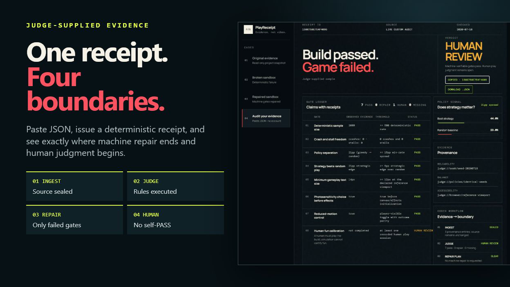

# PlayReceipt

> **Build passed. Game failed.**

PlayReceipt is an evidence gate for AI-built games. It converts reliability, balance, accessibility, and human-play evidence into stable receipts with four honest outcomes: `PASS`, `REPAIR`, `HUMAN_REVIEW`, or `UNVERIFIED`.

**Live demo:** [playreceipt.vercel.app](https://playreceipt.vercel.app)

**1:40 demo video:** [youtu.be/9M4A2hQYgps](https://youtu.be/9M4A2hQYgps)

**Build Week submission:** [devpost.com/software/playreceipt](https://devpost.com/software/playreceipt)



## Why it exists

AI coding tools can make a build green quickly. A green build does not prove that player choices matter, the interface is safe to read, or the game is fun. PlayReceipt makes those missing claims visible and refuses to manufacture certainty.

The included real-project case is the point: 2,000 seeded runs completed with zero crashes and stalls, yet weak policy separation, no reduced-motion proof, and no human fun calibration keep the verdict at `REPAIR`.

## Run it

### Installation and supported platforms

- **No-build judge path:** the hosted demo works in current desktop and mobile browsers with no account or installation.
- **CLI and local dashboard:** Node.js 20+ on Windows, macOS, or Linux. The committed runtime receipts verify Windows Node 20 and Linux/WSL; macOS remains supported by the Node runtime contract but was not independently exercised for this submission.
- **GitHub Action:** any GitHub Actions runner that supports the `node20` JavaScript-action runtime.

There are no runtime npm dependencies and no `npm install` step. Clone or download the public repository, then run:

```bash
git clone https://github.com/Yesol-Pilot/playreceipt.git
cd playreceipt
npm test
npm run demo
```

Open `http://127.0.0.1:4175`.

The browser includes **Audit your evidence**: paste a JSON evidence bundle (up to 64 KiB), receive the exact same deterministic receipt as the CLI, then copy or download it. The endpoint is credential-free, stores no submission history, and returns `415` for non-JSON requests.

### 30-second judge path

1. Open the [live demo](https://playreceipt.vercel.app) and choose **Audit your evidence**.
2. Keep the preloaded sample or paste a document matching [`public/schema/game-evidence.schema.json`](public/schema/game-evidence.schema.json).
3. Select **Issue receipt**, then copy the exact JSON. The expected boundary is `HUMAN_REVIEW`, not `PASS`.

The same no-build test works over HTTP:

```bash
curl -X POST https://playreceipt.vercel.app/api/receipt \
  -H "content-type: application/json" \
  --data-binary @examples/repaired-evidence.json
```

CLI examples:

```bash
node src/cli.js audit examples/overclock-20260717.json
node src/cli.js simulate broken
node src/cli.js simulate repaired
```

CLI exit codes are designed for agents and CI:

| Exit | Verdict | Meaning |
|---:|---|---|
| 0 | `PASS` | All supplied gates pass |
| 2 | `REPAIR` | At least one threshold fails |
| 3 | `UNVERIFIED` | Required evidence is missing |
| 4 | `HUMAN_REVIEW` | Machine gates pass; human judgment remains |

### GitHub Action

The repository is also a dependency-free JavaScript action. It runs the same audit engine and publishes `verdict` and `receipt-id` outputs. `REPAIR` and `UNVERIFIED` fail the job; `HUMAN_REVIEW` stays successful with a visible warning so automation cannot self-certify fun.

```yaml
- uses: Yesol-Pilot/playreceipt@main
  id: playreceipt
  with:
    evidence: path/to/game-evidence.json

- run: echo "${{ steps.playreceipt.outputs.verdict }}"
```

See the executable example in [`.github/workflows/playreceipt.yml`](.github/workflows/playreceipt.yml).

## The eight gates

PlayReceipt checks deterministic sample size, crash/stall freedom, policy separation, strategic edge over random play, minimum gameplay font size, photosensitivity choice, reduced-motion support, and human fun calibration. Rules and thresholds are explicit in [BUILDSPEC.md](BUILDSPEC.md).

The receipt ID is the first 16 hex characters of a SHA-256 hash over canonical project, date, and gate data. Identical evidence produces an identical receipt.

## Four-path demo

- **Original evidence** — a read-only snapshot copied from `NEO-GENESIS: OVERCLOCK`; verdict `REPAIR`.
- **Broken sandbox** — deterministic low-signal balance and missing reduced motion; verdict `REPAIR`.
- **Repaired sandbox** — identical audit rules with measurable strategy signal and accessibility repair; verdict `HUMAN_REVIEW`, because automation cannot certify fun.
- **Audit your evidence** — a judge-supplied JSON bundle audited live with a copyable/downloadable receipt and a visible ingest → judge → repair-plan → human-boundary trail.

The sandbox is a self-contained demonstration. It is not presented as a repair to the original game.

## Codex integration

The repository includes a project skill at `.codex/skills/playreceipt/SKILL.md`. Codex can normalize a game's evidence, call the CLI or CI action, interpret exit codes, preserve the source, turn only failed machine gates into a repair plan, and rerun the same seeds after a repair. This keeps the tool useful beyond its visual dashboard.

### How Codex and GPT-5.6 shaped the project

This was not a one-prompt code generation exercise. The primary Codex thread acted as the product and engineering loop:

1. **Product decision:** Codex challenged the original “release score” direction because one number would blur missing evidence and subjective fun. We locked four verdicts—`PASS`, `REPAIR`, `HUMAN_REVIEW`, and `UNVERIFIED`—before implementation.
2. **Engineering acceleration:** GPT-5.6 implemented the dependency-free audit engine, seeded simulator, CLI, HTTP/Vercel adapters, browser interface, and GitHub Action. Every surface imports the same `src/audit.js` rather than copying verdict logic.
3. **Design decision:** We rejected a generic analytics dashboard. The final interface is a forensic receipt: observed claim, explicit threshold, source path, minimum repair, and the point where automation must stop.
4. **Audit → repair → re-audit:** Independent adversarial review found real CLI argument and HTTP path defects. Codex repaired them, converted each finding into a regression test, and reran the same cases. The 120-point uplift then added judge-supplied JSON, exact receipt handoff, abuse boundaries, and CI behavior—with another review gate before release.
5. **Evidence discipline:** The pre-existing game contributes only three hashed, read-only evidence files. Dated commits, browser readbacks, deterministic receipts, and the primary Session ID distinguish Build Week work from prior source material.

The result is a working example of Codex as an engineering control loop: specify the claim, build the smallest executable proof, attack it, repair it, and preserve the receipt.

## Build Week provenance

PlayReceipt is new work created for OpenAI Build Week in the Developer Tools track. The existing game contributes only the three read-only evidence artifacts under `examples/source/overclock/`. Product intent, implementation, simulations, UI, tests, receipts, and documentation are new work in this repository.

- Product thesis: [PRODUCT_INTENT.md](PRODUCT_INTENT.md)
- Technical contract: [BUILDSPEC.md](BUILDSPEC.md)
- Judging strategy: [RUBRIC.md](RUBRIC.md)
- Architecture decision and source boundary: [DECISION_RECORD.md](DECISION_RECORD.md)
- Deterministic receipts: [`docs/evidence/`](docs/evidence/)
- Local GitHub Action pass/block receipt: [`docs/evidence/action-local-20260718.json`](docs/evidence/action-local-20260718.json)
- Linux/WSL 11-test portability receipt: [`docs/evidence/linux-wsl-verification-20260718.json`](docs/evidence/linux-wsl-verification-20260718.json)
- Executed test coverage and adapter-contract receipt: [`docs/evidence/coverage-verification-20260718.json`](docs/evidence/coverage-verification-20260718.json)
- Windows Node 20 + Linux runtime matrix: [`docs/evidence/runtime-matrix-verification-20260718.json`](docs/evidence/runtime-matrix-verification-20260718.json)
- Live deployment receipt: [`docs/evidence/deployment-20260718.json`](docs/evidence/deployment-20260718.json)
- Public video receipt: [`docs/evidence/video-20260718.json`](docs/evidence/video-20260718.json)
- Versioned 1080p uplift-video candidate receipt: [`docs/evidence/video-uplift-candidate-20260718.json`](docs/evidence/video-uplift-candidate-20260718.json)
- Devpost submission receipt: [`docs/evidence/devpost-submission-20260718.json`](docs/evidence/devpost-submission-20260718.json)

Built with Codex and GPT-5.6. The required submission feedback field will contain the public Codex Session ID used to build and verify this repository.

## Honest limitations

- Current rules are intentionally game-specific and opinionated, not a universal quality standard.
- Human fun calibration remains a human decision.
- The dashboard audits supplied evidence; it does not crawl arbitrary game repositories by itself.
- The real-project snapshot proves the audit boundary, not that the original game was repaired.

## License

MIT. The copied evidence is included for audit demonstration and retains its original project provenance; do not interpret it as a separately licensed game distribution.
